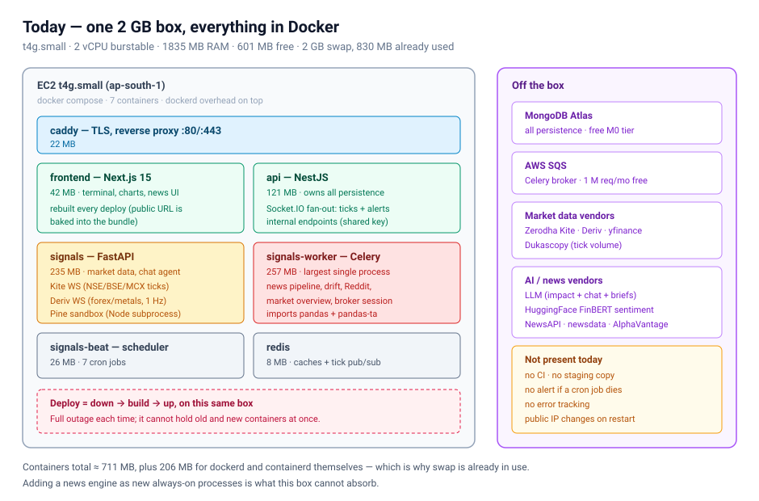
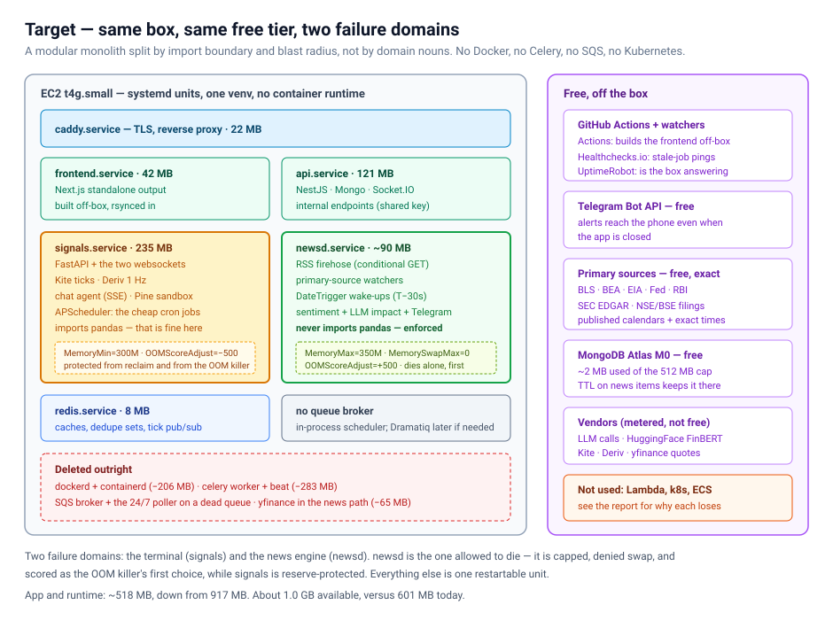
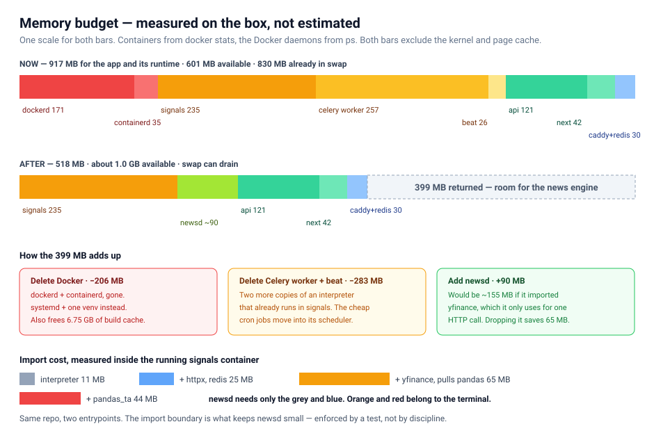
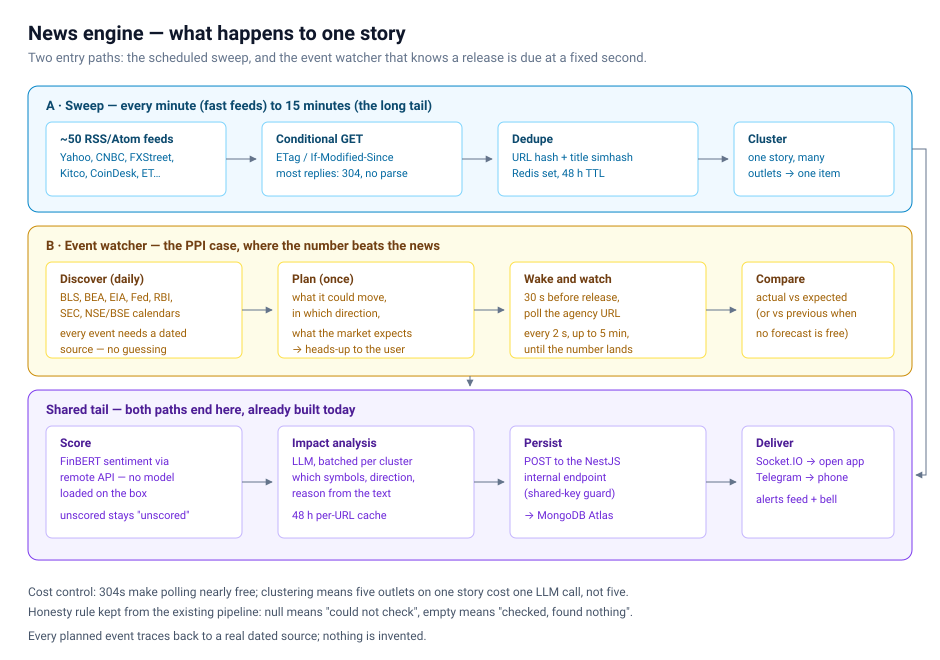
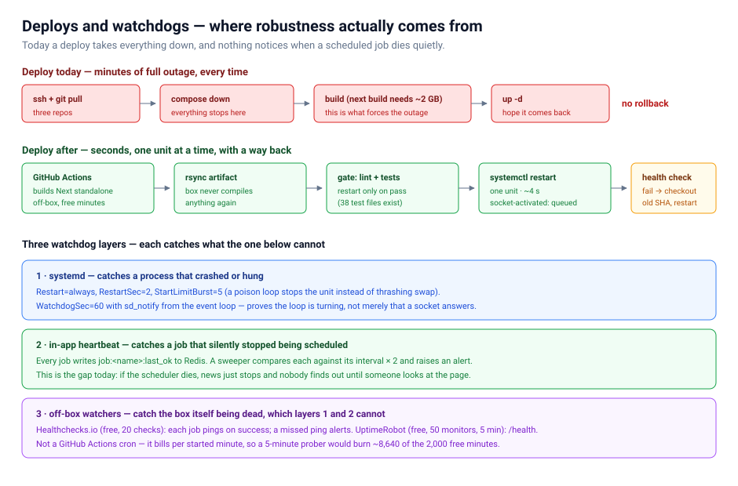

# Hosting AI Trader on the free tier, on the box we already have

**Question.** Can the product — terminal, paper trading, AI chat, and the new self-built news engine — run robustly on the current single `t4g.small` (2 GB) and free services, without changing the box or the cloud?

**Answer.** Yes, with room to spare. The box isn't too small. It's carrying about 490 MB of overhead that does no product work: the Docker runtime, and two extra copies of the Python interpreter for Celery. Removing that returns ~400 MB, which is more than the news engine needs.

**How this was decided.** Two agents argued opposite positions against the real codebase: one for consolidating on the box, one for offloading periodic work to free external compute (Lambda, EventBridge, Cloudflare Workers). They then rebutted each other. Every number below was measured on the running box, not estimated. The debate, including what each side conceded, is in [§3](#3-the-debate).

---

## 1. Verdict at a glance

| Question | Decision | The deciding reason |
|---|---|---|
| Monolith or microservices | **Modular monolith, two Python processes** | Split by import boundary and blast radius, not by domain. Every extra Python service costs 80–250 MB just to exist. |
| Docker | **Remove it** | `dockerd` + `containerd` cost 206 MB, measured. That's a third of today's free memory. |
| Kubernetes (incl. k3s) | **No** | It solves multi-node scheduling we don't have, and its control plane alone costs more memory than the news engine. |
| AWS Lambda | **No, for now** | 573 MB of Python dependencies against a 250 MB package limit, plus cold starts at the exact second a release lands. Both agents agreed. |
| Celery | **Remove it** | Minute granularity can't express "wake at 08:29:30 ET". It uses no retries or results today, yet costs 283 MB. |
| Dramatiq / RQ | **Not yet. Dramatiq is the upgrade path.** | Seven idempotent, hourly-or-rarer jobs don't need a broker. RQ forks per job, and its scheduler is a second process. |
| Scheduler | **APScheduler, in-process** | Second-precision `DateTrigger`, overlap protection, and misfire recovery. It awaits coroutines directly. |
| SQS | **Delete it** | A 24/7 poller hits a queue nothing writes to (~4,300 calls/day). It also sits on the readiness path, where an AWS blip can break startup. |
| Frontend build | **Off the box, on GitHub Actions** | Building Next.js on the box is what forces a full outage on every deploy. |
| Monitoring | **Healthchecks.io + UptimeRobot, both free** | Nothing today notices when a scheduled job stops. |
| Alerts outside the app | **Telegram Bot API, free** | The cheapest way to put an alert on a phone. |

---

## 2. What the box is doing today



Measured on the live box:

| What | Number |
|---|---|
| RAM | 1835 MB total, **601 MB available**, 2 GB swap with **830 MB already used** |
| Docker runtime | `dockerd` **171 MB** + `containerd` **35 MB** |
| Containers (`docker stats`) | celery worker 257 · signals 235 · api 121 · frontend 42 · beat 26 · caddy 22 · redis 8 |
| CPU | load average **0.19**, uptime 20 days. CPU is not the constraint, memory is. |
| Disk | 78% used, 4.2 GB free. **6.75 GB of it is reclaimable Docker build cache.** |
| MongoDB Atlas | **~2 MB of the 512 MB free cap** (0.8 MB data, 1.5 MB indexes) |
| Python import cost | interpreter 11 MB · httpx+redis +25 · **yfinance +65** · pandas_ta +44 |

Findings that shaped the design:

- **The same Python codebase runs three times**: API, worker and beat, each paying for its own interpreter and imports.
- **The news path imports pandas for no reason.** `app/market/news.py` imports `app/market/macro_events.py`, which imports `yfinance` at line 25. Its only use is `yf.Ticker(t).news`, an HTTP call that never touches a DataFrame. That one import costs 65 MB.
- **SQS is dead weight.**
  - `ai-trader-api/src/signals/signals.service.ts` long-polls every 20 s, forever, for signals from a screener that no longer runs.
  - `main.py` checks SQS inside `/ready`, and Compose gates the API and worker on that check.
- **A background job has already broken a user-facing feature.** `docker/signals/Dockerfile` records the Pine sandbox being OOM-killed mid-request, which users saw as indicators failing to load. Isolation is not theoretical here.
- **Some OS services a server doesn't need** (`fwupd`, `ModemManager`, `udisks2`, `snapd`) take ~100 MB between them.

---

## 3. The debate

### Position A: consolidate on the box
- **Topology:** two Python processes under systemd, with no Docker, no Celery and no SQS. `signals` holds the API, websockets and cheap cron jobs; `newsd` holds the news engine and never imports pandas.
- **Scheduler:** APScheduler, because Celery beat is minute-grained and the event watcher needs second precision.
- **Why no broker:** the jobs are already idempotent. The code declines every Celery feature it pays for: no result backend, no retries, and every task catches its own exceptions.

### Position B: offload the periodic work
- **Topology:** the box keeps only what must be long-lived (websockets, API, frontend). RSS polling goes to Cloudflare Workers; parsing, scoring, the event watcher and Telegram go to Lambda with EventBridge; state goes to DynamoDB.
- **Free-tier headroom:** it showed the arithmetic, and the fit was comfortable: ~17k of 1M Lambda requests, ~45k of 400k GB-seconds, ~1,600 of 100k daily Workers requests.
- **Its strongest point:** physical separation is the only isolation that survives global memory pressure.

### What each conceded in rebuttal

| Point | Outcome |
|---|---|
| Delete Docker first | **B conceded.** 206 MB is more than B's whole migration frees, for near-zero new surface. |
| EventBridge vs `DateTrigger` for the event watcher | **B conceded.** A warm process has a warm connection pool and a warm LLM key; a cold start at T−30s is the worst possible time. |
| Is a memory cap real isolation? | **A conceded.** `MemoryMax` bounds the offender but doesn't protect the victim. Global OOM picks victims by badness across all processes. A added reservation and scoring knobs (see [§6](#6-robustness)). |
| yfinance in the news path | **Both agreed.** Replace it with a direct HTTP call. |
| Separate `newsd` with an import boundary | **Both adopted it.** It's also the exact boundary a Lambda would need later, so the offload option stays open. |
| Watching from outside the box | **A adopted it.** An on-box watchdog cannot report its own box being dead. |
| CPU credits | **Unresolved, and B is right.** Credits are an instance-level balance, so cgroups cannot ration them. It's mitigated in [§6](#6-robustness), not solved. |

### Why offload loses, for now
Once Docker and Celery are gone, B's remaining case rests on load that grows with feed count. Conditional GETs make that load nearly flat: most polls come back `304 Not Modified`, with no body and no parsing.

Against that, offload would mean:
- four platforms and a CI prerequisite, for one developer;
- a Bedrock key minted on every Lambda cold start, instead of once in a warm worker;
- a news dependency set that doesn't fit in a zip Lambda without surgery.

**Revisit if** the feed count passes ~150, or the CPU credit balance trends down week over week.

---

## 4. Target architecture



### Two failure domains

**`signals.service`** — the terminal:
- Runs FastAPI, the Kite and Deriv websockets, chat over SSE, the Pine sandbox, and APScheduler for the cheap jobs: drift check, Reddit sentiment, market overview, Kite session refresh and square-off.
- Imports pandas. That's fine, because the terminal genuinely needs it.
- Is reserve-protected from reclaim and ranked last for the OOM killer.

**`newsd.service`** — the news engine:
- Runs the RSS firehose, primary-source watchers, event wake-ups, scoring, impact analysis and Telegram delivery.
- **Never imports pandas.** A test enforces this.
- Is the process allowed to die: capped, denied swap, and ranked first for the OOM killer. When it dies, the terminal doesn't notice.

**Everything else** — Caddy, the Next.js standalone server, the NestJS API, Redis — runs as plain systemd units.

### Why two processes, not one, and not six
- **Not one:** a 50-feed parse plus concurrent LLM responses in the same process as the Kite websocket is how the Pine sandbox got killed last time.
- **Not six** (news, market data, chat, alerts, scheduler, auth): each Python service costs its own interpreter. Services would call each other over the network with no team to parallelise work across them. And the box would spend its memory on boundaries instead of product.

**The rule:** split where the import set or the failure consequence differs. Not where the nouns differ.

### Memory after the change



**917 MB → ~518 MB** for the app and its runtime. About **1.0 GB available**, up from 601 MB.

The 399 MB comes from:
- Docker removed: −206 MB
- Celery worker and beat removed: −283 MB
- newsd added: +90 MB (it would be ~155 MB with yfinance)

---

## 5. The news engine on this design



**Sweep** — about 50 RSS feeds:
- Tiered: fast feeds every minute, the long tail every 10–15.
- Every request is a conditional GET, with `ETag` / `Last-Modified` stored in Redis, so most replies are `304` and cost no parsing.
- Dedupe by canonical URL hash plus title shingles, reusing the Redis TTL pattern `news.py` already uses.
- **Cluster before calling the LLM**, so five outlets on one story cost one analysis.

**Event watcher** — the PPI case:
1. A daily job reads official calendars (BLS, BEA, EIA, Fed, RBI, SEC EDGAR, NSE/BSE).
2. It registers an APScheduler `DateTrigger` 30 seconds before each release.
3. At that moment, `newsd` polls the agency URL every 2 s for up to 5 minutes.
4. It compares the number against expectations, explains the likely impact, and publishes.

Everything else is reused: a warm process, a warm connection pool, a cached LLM key. No new platform.

**Shared tail (unchanged):**
- FinBERT sentiment via the remote API (no model loaded on the box)
- LLM impact analysis with the existing 8-article chunks and 48-hour per-URL cache
- a POST to the NestJS internal endpoint, which writes to Mongo
- Socket.IO to open apps, and Telegram to phones

---

## 6. Robustness



### Isolation — knobs that actually protect the terminal

```ini
# signals.service — the terminal: protected
[Service]
MemoryMin=300M          # hard reservation, never reclaimed
OOMScoreAdjust=-500     # last choice for the OOM killer
CPUWeight=200           # wins CPU contention

# newsd.service — the news engine: allowed to die, alone
[Service]
MemoryMax=350M          # a runaway parse is killed inside its own cgroup
MemorySwapMax=0         # never pushes the tick feed's pages into swap
OOMScoreAdjust=500      # first choice under global pressure
CPUWeight=50
```

A cap alone is not enough, and the debate settled why. `MemoryMax` bounds `newsd`'s own growth. `MemoryMin` and `OOMScoreAdjust` on `signals` are what protect the terminal when the whole box is under pressure.

### Hangs and crashes
- `Restart=always`, `RestartSec=2`, `StartLimitBurst=5` — a crash loop stops the unit instead of thrashing swap.
- `WatchdogSec=60` with `sd_notify` from the event loop. That proves the loop is turning, not just that a socket answers.
- APScheduler `max_instances=1` stops a slow news run from overlapping the next one.
- **Use APScheduler's Redis job store, not the default in-memory one.** With schedules persisted, `misfire_grace_time` runs the 15:20 square-off late if the process was down at 15:20. With the in-memory store, a restart forgets it was due and silently skips it.
- An explicit timeout per job class (news 240 s, watcher 300 s, drift 60 s). The one outbound call without a timeout today is the LLM call in `_analyze_chunk`, and it gets one.

### Knowing when something silently stopped — the biggest gap today
1. **In the app.** Every job writes `job:<name>:last_ok` to Redis. A sweeper checks each one against its interval × 2 and raises an alert.
2. **Off the box.** Each job pings its own Healthchecks.io check on success (free: 20 checks), and a missed ping alerts. UptimeRobot (free: 50 monitors, 5-minute interval) watches `/health`.
   - **Not** a scheduled GitHub Action: those bill per started minute, so a 5-minute prober would burn ~8,640 minutes a month against a 2,000-minute allowance.

### Deploys — seconds, one unit, with a way back
- **Frontend:** built as Next.js `standalone` output in GitHub Actions, then rsynced. The box never compiles again. That removes today's full outage and the 7 GB of build cache.
- **Python:** `git pull`, then lint and the existing test suite as a gate, then `systemctl restart` of one unit.
  - Socket activation keeps incoming requests queued during the ~4-second restart.
  - If `/health` fails afterwards, the script checks out the previous commit and restarts. That's about 15 lines in `deploy.sh`.
- **Honest trade-off:** restarting `signals` drops open websockets and chat streams. The reconnect path already exists (`main.py` resubscribes live ticks on startup); an in-flight chat turn is lost and must be retried. Today's deploys drop everything for minutes, so this is still a large step forward.

### CPU credits — mitigated, not solved
A `t4g.small` is burstable. Credits are an instance-wide balance that cgroups can't divide.

The mitigations:
- conditional GETs, and the tiered polling intervals;
- clustering before the LLM, so fewer calls;
- `CPUWeight` favouring `signals`;
- a CloudWatch alarm on `CPUCreditBalance` (basic metrics and 10 alarms are free).

If the balance trends down week over week, that's the signal to revisit offload for the firehose.

### Box hygiene
- **Attach an Elastic IP.** Free while attached, and it stops the `sslip.io` hostname, the TLS certificate and the Atlas allow-list from breaking on every restart.
- **Disable** `fwupd`, `ModemManager`, `udisks2` and `snapd` (keep the SSM agent only if you use it) — about 100 MB.
- **Add a TTL index** on per-article news documents, so Atlas stays nowhere near its cap as volume grows.

---

## 7. Free services used, and the arithmetic

| Service | Free allowance | Our use | Headroom |
|---|---|---|---|
| EC2 `t4g.small` | not free — already paid, ~$12/mo | same box | — |
| MongoDB Atlas M0 | 512 MB | ~2 MB now; ~60 MB steady state with a 30-day TTL on news | ~8× |
| GitHub Actions | 2,000 min/mo (private repos) | a frontend build per deploy, ~6 min × ~20/mo ≈ 120 min | ~16× |
| Healthchecks.io | 20 checks | ~9 (one per scheduled job) | 2× |
| UptimeRobot | 50 monitors, 5 min | 2–3 | plenty |
| Telegram Bot API | free | alert delivery | — |
| CloudWatch | basic metrics, 10 alarms | 1–2 alarms | plenty |
| Primary data sources | free, official | calendars + releases | — |
| RSS feeds | free | ~50 feeds, mostly `304` replies | — |

**Still metered no matter the architecture:** LLM calls, HuggingFace sentiment, and market data vendors.

**Considered and rejected:**
- **Lambda, EventBridge, DynamoDB** — free at this volume, but they lost the debate (§3).
- **Cloudflare Workers** — 10 ms of CPU per call on the free plan can't parse feeds.
- **ECS/Fargate** — not free.
- **Kubernetes** — not worth its memory.

---

## 8. Migration order

Each step ships and can be reverted on its own. The first four are almost entirely deletion, and they create the headroom before any new code lands.

| # | Step | Memory | Risk |
|---|---|---|---|
| 0 | Hygiene: prune build cache (−6.75 GB disk), disable unneeded OS services, Elastic IP, CPU credit alarm | ≈ −100 MB | none |
| 1 | **Delete SQS.** The signal publisher becomes an HTTP POST to the API's internal endpoint (the pattern alerts and news already use). Remove the NestJS poller and the SQS readiness probe. Drop `kombu[sqs]` — **keep `boto3`, which `app/config.py` needs to sign Bedrock requests.** | small | low |
| 2 | **Drop yfinance from the news path** (`macro_events.py` → direct HTTP), plus a test that fails if the news entrypoint imports pandas | −65 MB per news process | low: we now own changes to Yahoo's unofficial endpoint |
| 3 | **APScheduler inside `signals`** for the cheap jobs. Run it alongside beat for a day and compare logs, then delete beat | −26 MB | low |
| 4 | **`newsd` entrypoint** runs news analysis; delete the Celery worker | −257 MB, +90 MB | medium: the heaviest job moves |
| 5 | `signals` and `newsd` move to systemd with the isolation knobs. API, frontend, Caddy and Redis stay in Compose for now | isolation in place | medium |
| 6 | Frontend build moves to GitHub Actions; API, Caddy and Redis move to systemd; **remove Docker** | −206 MB | medium: one careful cutover |
| 7 | Heartbeats, Healthchecks.io, UptimeRobot, and the deploy gate with rollback | — | low |
| 8 | **RSS firehose** in `newsd` | +10–20 MB | low |
| 9 | **Event watcher** with `DateTrigger`, plus Telegram delivery | small | low |

**When to reach for more:**
- **Dramatiq on the local Redis** — the day a job needs durable retries or fan-out across processes. From APScheduler calling a coroutine, it's roughly a 50-line change.
- **Offload the firehose** — if the CPU credit balance trends down, or feeds pass ~150. The `newsd` import boundary is already the shape a Lambda needs.
- **A bigger box** — when real users arrive and memory is spent on product, not overhead. Today it isn't.

---

## 9. Open risks

- **CPU credits** are instance-wide, and nothing here fully isolates them. Watch the alarm.
- **Restarting `signals` still drops live connections**, briefly. Much better than today, but not zero-downtime; that would need a second instance.
- **Owning the Yahoo news call** instead of yfinance means we absorb that unofficial endpoint's changes.
- **One box is still one box.** A hardware or AZ failure takes everything down. The watchers will tell you within five minutes; they cannot prevent it.
- **No staging copy.** The deploy gate and rollback reduce the risk of a bad release; they don't replace testing it somewhere first.
