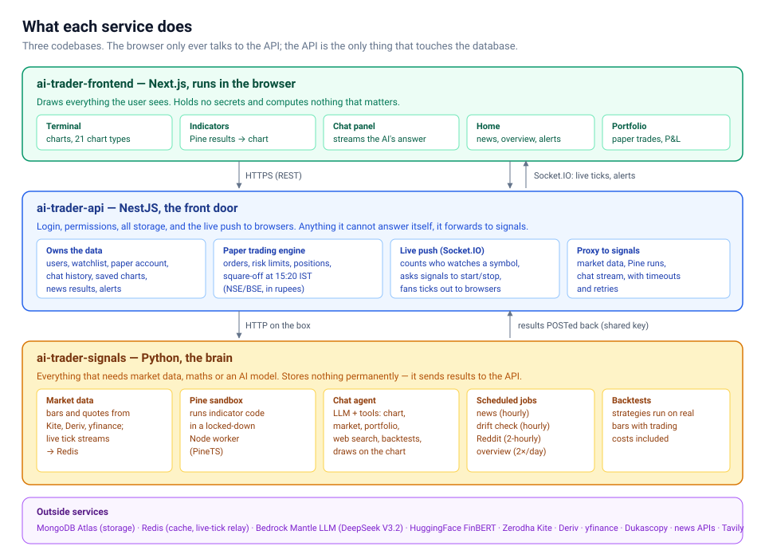
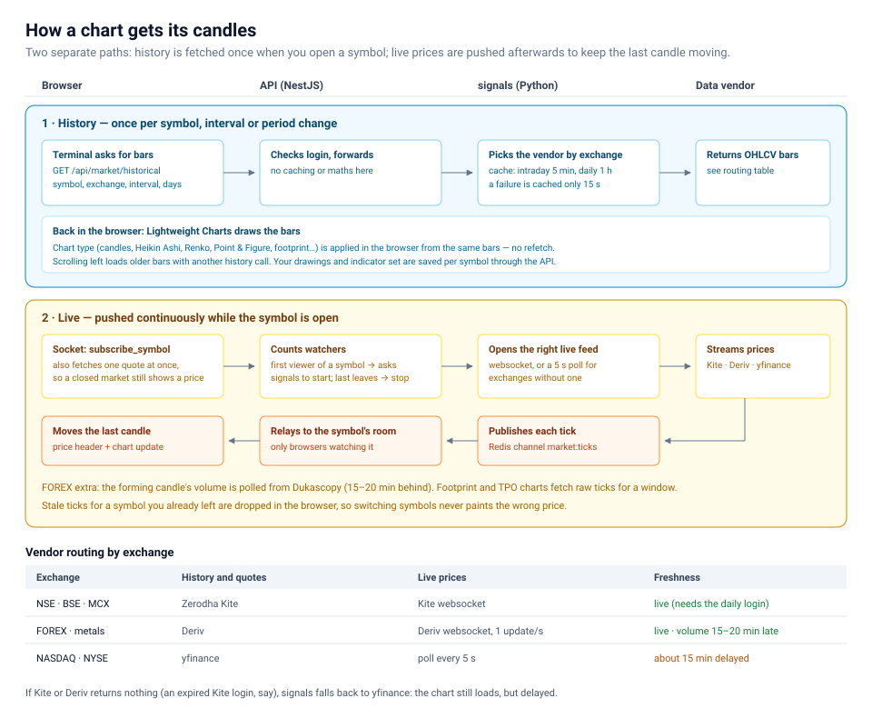
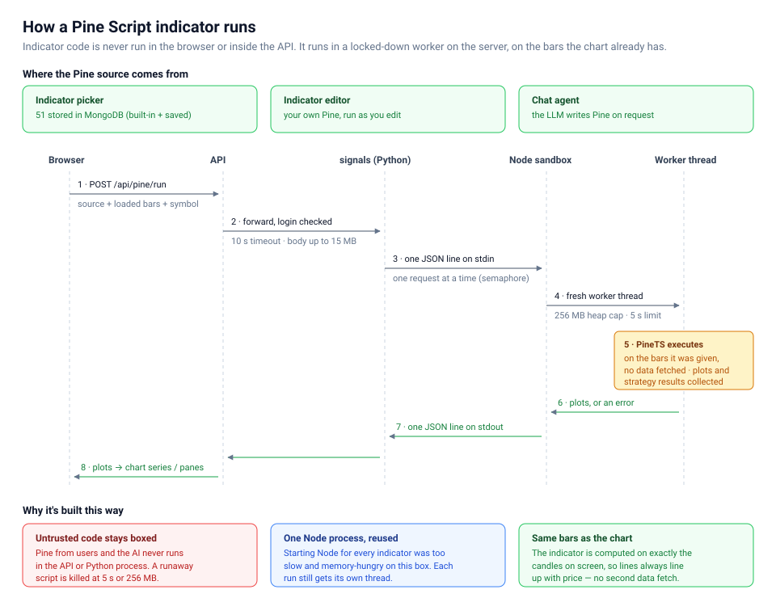
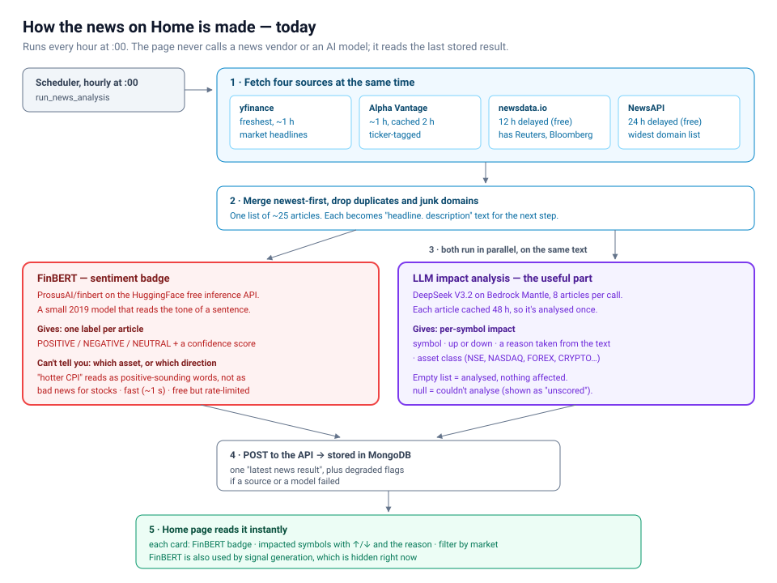
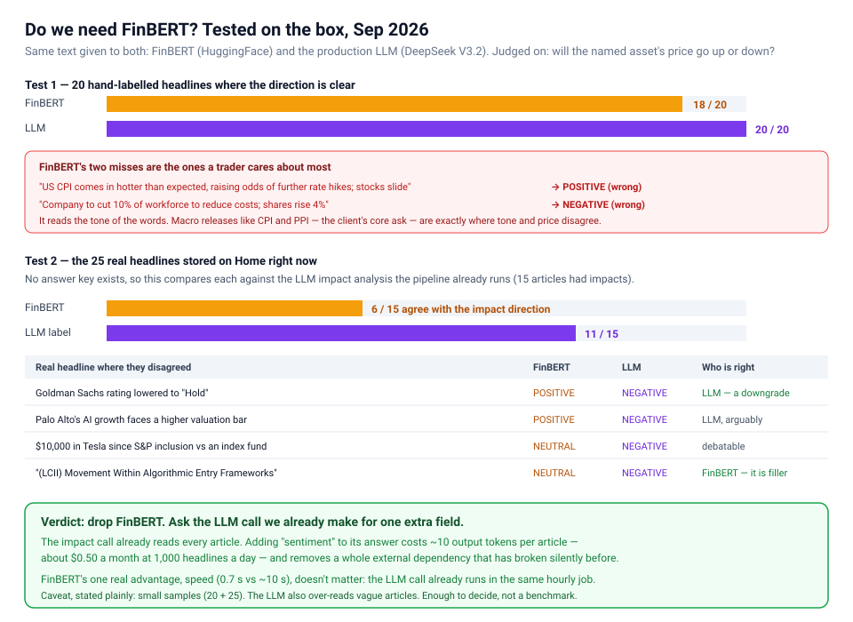
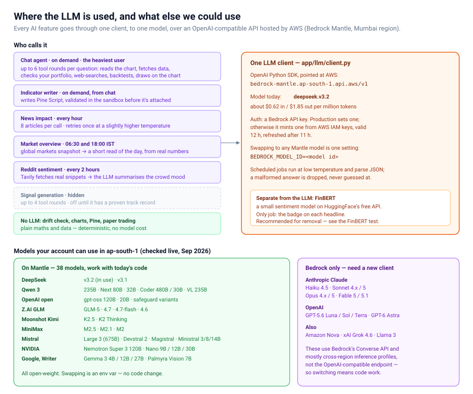

# How AI Trader works

A plain walkthrough of what runs where, and what happens when someone opens a chart, adds an indicator, or reads the news. Every number here was checked against the code or measured on the live box in September 2026.

**Contents**
1. [The three services](#1-the-three-services)
2. [Charts: how candles get on screen](#2-charts-how-candles-get-on-screen)
3. [Pine Script: how an indicator runs](#3-pine-script-how-an-indicator-runs)
4. [News: how Home gets its headlines](#4-news-how-home-gets-its-headlines)
5. [FinBERT: do we need it?](#5-finbert-do-we-need-it)
6. [The LLM: where it's used, and which models are available](#6-the-llm-where-its-used-and-which-models-are-available)
7. [Which model is best? The bake-off](#7-which-model-is-best-the-bake-off-sep-2026)

---

## 1. The three services

AI Trader is three separate codebases. Each has one job.

**`ai-trader-frontend` (Next.js) — what the user sees**
- Terminal and charts, the indicator picker, the chat panel, Home, and Portfolio.
- Holds no secrets and does no important calculation.
- Talks only to the API: REST for requests, plus a Socket.IO connection for live prices and alerts.

**`ai-trader-api` (NestJS) — the front door**
- **Login and permissions.**
- **All permanent data** lives here, and only here, in MongoDB: users, watchlists, the paper trading account, chat history, saved chart layouts, news results, alerts.
- **The paper trading engine:** orders, risk limits, positions, and the 15:20 IST square-off. It handles NSE/BSE only, in rupees.
- **Live push:** tracks which browsers watch which symbol, asks signals to start or stop feeds, and fans ticks out.
- **Anything it can't answer itself** it forwards to signals, with timeouts and retries.

**`ai-trader-signals` (Python) — the brain**
- Everything that needs market data, maths or an AI model:
  - fetching bars and live prices;
  - running Pine Script;
  - the chat agent and backtests;
  - the scheduled jobs (news, drift check, Reddit sentiment, market overview).
- **Stores nothing permanently.** It sends every result to the API over an internal endpoint protected by a shared key.

**Supporting pieces**
- **MongoDB Atlas** — the database (free tier, ~2 MB used).
- **Redis** — a cache, and the relay that carries live ticks from signals to the API.
- **Outside vendors** for data and AI, covered below.

---

## 2. Charts: how candles get on screen

A chart has two independent data paths.

### History — fetched when you open a symbol
1. The terminal asks the API for bars (`GET /api/market/historical`) with the symbol, exchange, candle interval and how many days.
2. The API checks you're logged in and forwards the request to signals.
3. signals picks the data vendor by exchange (table below) and caches the answer: 5 minutes for intraday bars, 1 hour for daily. A *failed* fetch is cached for only 15 seconds, so a vendor blip doesn't blank the chart for long.
4. The browser draws the bars with **Lightweight Charts**.

Things that happen in the browser, without refetching:
- **Chart types** (Heikin Ashi, Renko, Point & Figure, footprint…) are built from the same bars.
- **Scrolling left** is the one exception: it asks for older history.
- **Drawings and the indicator set** are saved per symbol through the API.

### Live — pushed while the symbol is open
1. The browser sends `subscribe_symbol` over Socket.IO. It also fetches one quote immediately, so a closed market still shows a price.
2. The API counts viewers per symbol. The **first** viewer makes it ask signals to start a feed; when the **last** leaves, it asks signals to stop. Nobody watching means no feed and no cost.
3. signals opens the right feed: a websocket where one exists, or a 5-second poll where it doesn't.
4. Each price is published to the Redis channel `market:ticks`.
5. The API relays it only to browsers watching that symbol.
6. The browser moves the last candle and the price header. Ticks for a symbol you've already switched away from are ignored, so the wrong price never flashes up.

### Where the data comes from

| Exchange | History and quotes | Live prices | Freshness |
|---|---|---|---|
| NSE · BSE · MCX | Zerodha Kite | Kite websocket | Live. Needs the daily Kite login, which a scheduled job refreshes at 06:00 IST. |
| FOREX · metals | Deriv | Deriv websocket, 1 update/second | Live. Candle **volume** comes from Dukascopy and runs 15–20 minutes behind. |
| NASDAQ · NYSE | yfinance | Polled every 5 seconds | About 15 minutes delayed. The chart says so. |

If Kite or Deriv returns nothing — an expired Kite login, say — signals falls back to yfinance for quotes and history. The chart still loads, but those prices are delayed.

For forex, footprint and TPO charts also fetch raw ticks for the visible window.

---

## 3. Pine Script: how an indicator runs

Pine Script is TradingView's indicator language. We run it with **PineTS**, an open-source Pine interpreter for JavaScript.

### Where the code comes from
- **The indicator picker** — 51 indicators stored in MongoDB, built-in plus saved.
- **The indicator editor** — your own Pine, re-run as you edit.
- **The chat agent** — the LLM writes Pine on request. It's checked against sample bars before it's attached, and any error goes back to the LLM to fix.

### What happens when one runs
1. The browser sends the Pine source, **the bars already on the chart**, and the symbol to `POST /api/pine/run`.
2. The API checks login and forwards it to signals: 10-second timeout, body up to 15 MB (a long intraday history is large).
3. signals passes the request as one JSON line to a **single long-running Node.js process**, one request at a time.
4. That process starts a **fresh worker thread** for this run, capped at **256 MB of memory** and **5 seconds**. A script that loops forever or eats memory is killed there, and nothing else is affected.
5. PineTS runs the script on the bars it was given. It fetches no data of its own.
6. The plots (or an error) come back the same way, one JSON line.
7. The browser turns each plot into a chart series or a separate pane.

### Why it's built this way
- **Untrusted code stays boxed.** Pine written by users or the AI never runs inside the API or the main Python process.
- **One Node process, reused.** Starting Node from scratch for every indicator was slow, and it pushed the small server into memory trouble. Each run still gets its own isolated thread.
- **Same bars as the chart.** The indicator is computed on exactly the candles on screen, so its lines always line up with price.

---

## 4. News: how Home gets its headlines

The Home page never calls a news vendor or an AI model directly. A scheduled job does the work **every hour at :00**, and the page reads the stored result instantly.

1. **Fetch four sources at once.** If any of them fails, the others still count.
   - **yfinance** — the freshest, about 1 hour behind.
   - **Alpha Vantage** — about 1 hour behind, cached 2 hours, tagged by ticker.
   - **newsdata.io** — 12 hours delayed on the free plan, but it carries Reuters and Bloomberg.
   - **NewsAPI** — 24 hours delayed on the free plan, with the widest spread of sites.
2. **Merge** newest-first, drop duplicates and junk domains. Result: about 25 articles, each turned into `headline. description` text.
3. **Two analyses run in parallel on that text:**
   - **FinBERT** gives each article one sentiment label.
   - **The LLM** (DeepSeek V3.2) reads 8 articles per call and lists which symbols each one affects, up or down, a reason drawn from the text, and the market it trades on. Each article is cached 48 hours, so it's analysed once, not every hour.
4. **Store:** the result is POSTed to the API and saved in MongoDB, with flags if a source or a model failed.
5. **Show:** each Home card displays the FinBERT badge, the impacted symbols with ↑/↓ and the reason, and a filter by market.

**Honesty rule:** an empty impact list means "analysed, nothing affected". `null` means "couldn't analyse", and the UI shows it as *unscored* rather than pretending nothing happened.

---

## 5. FinBERT: do we need it?

**Short answer: no.** It's measurably worse at the question a trader actually asks, and the LLM call we already pay for can do its job for about fifty cents a month.

### What FinBERT is
`ProsusAI/finbert` is a small 2019 model, trained to read the **tone** of financial sentences. We call it through HuggingFace's free inference API. It returns POSITIVE, NEGATIVE or NEUTRAL with a confidence score.

It **cannot** say which asset a headline is about, or which way that asset's price moves. And tone is not direction: a hotter-than-expected inflation print *sounds* strong but is bad news for stocks.

### How it was tested
Both FinBERT and the production LLM (DeepSeek V3.2) got identical text. Both were run on the live box.

**Test 1 — 20 hand-labelled headlines** where the price direction is stated or unambiguous.

| | Correct |
|---|---|
| FinBERT | **18 / 20** |
| LLM | **20 / 20** |

FinBERT's two misses:

| Headline | FinBERT | Actual |
|---|---|---|
| US CPI comes in hotter than expected, raising odds of further rate hikes; stocks slide | POSITIVE | NEGATIVE |
| Company to cut 10% of workforce to reduce costs; shares rise 4% | NEGATIVE | POSITIVE |

The first is precisely the client's PPI/CPI use case.

**Test 2 — the 25 real headlines currently stored on Home.** There's no answer key, so each tool was compared against the per-symbol impact direction the pipeline already produces. 15 articles had impacts.

| | Agrees with impact direction |
|---|---|
| FinBERT | **6 / 15** |
| LLM label | **11 / 15** |

A real case: *"Goldman Sachs rating lowered to Hold"* → FinBERT said **POSITIVE**. A downgrade is not good news.

**In fairness to FinBERT:**
- It's fast: 0.7 seconds for 20 headlines, against about 10 seconds for the LLM.
- It correctly called one piece of SEO filler neutral that the LLM marked negative. The LLM over-reads vague articles.
- These samples are small (20 + 25). That's enough to make a decision, not a formal benchmark.

### Why dropping it is the right call
- **Direction is what matters.** The badge is read by traders as "good or bad for the price". FinBERT answers a different question.
- **Speed doesn't help.** The LLM impact call already runs in the same hourly job, so FinBERT finishing sooner changes nothing a user sees.
- **It costs almost nothing to replace.** Adding a `sentiment` field to the impact call we already make is ~10 extra output tokens per article: **about $0.50 a month at 1,000 headlines a day**, at DeepSeek V3.2's ~$1.85 per million output tokens.
- **One less thing to break.** The free HuggingFace API is rate-limited, needs its own token, and has already changed its response format once. That failure made every article silently "unscored" until someone noticed.

### What removal involves
1. Add `sentiment` to the impact analysis prompt and its JSON parsing in `app/market/news.py`.
2. Keep the "unscored" rule: if the LLM call fails, sentiment shows as unavailable.
3. Delete the HuggingFace code path and the `HF_API_TOKEN` setting.
4. Signal generation also uses FinBERT (`app/signals/sentiment.py`). That feature is hidden, so it can move to the LLM when signals come back.

---

## 6. The LLM: where it's used, and which models are available

### One client, one model
Every AI feature goes through `app/llm/client.py`:
- **SDK and endpoint:** the OpenAI Python SDK, pointed at AWS's OpenAI-compatible endpoint, **Bedrock Mantle**: `https://bedrock-mantle.ap-south-1.api.aws/v1` (Mumbai).
- **Model:** `deepseek.v3.2`, at about $0.62 per million input tokens and $1.85 per million output.
- **Auth:** a Bedrock API key. Production sets one explicitly. Without one, the client is meant to mint a key from AWS IAM credentials, valid 12 hours and refreshed after 11. **That fallback is currently broken:** `generate_bedrock_key` signs the request with `Version=1` included, and AWS rejects the signature. Production only works because the explicit key is set. The fix is to sign without `Version=1` and append it afterwards (verified working); it's item F1 on the checklist.
- **Switching models** is one setting: `BEDROCK_MODEL_ID`.

### Who calls it

| Feature | When | Notes |
|---|---|---|
| Chat agent | On demand | Heaviest user. Up to 6 tool rounds per question: reads the chart, fetches data, checks the portfolio, web-searches, backtests, draws. |
| Indicator writer | On demand, from chat | Writes Pine; validated before attaching. |
| News impact | Hourly | 8 articles per call; one retry at a slightly higher temperature. |
| Market overview | 06:30 and 18:00 IST | A short read of the day, from real market numbers. |
| Reddit sentiment | Every 2 hours | Tavily fetches real snippets; the LLM summarises them. |
| Signal generation | Hidden | Up to 4 tool rounds; off until it has a proven record. |

**No LLM:** the drift check, charts, Pine execution and paper trading. They're plain maths and data: deterministic, with no model cost.

### Models the account can use (checked live in ap-south-1)

**On Mantle — 38 models. They work with today's code; switch with `BEDROCK_MODEL_ID`.**

| Family | Models |
|---|---|
| DeepSeek | `deepseek.v3.2` (in use), `deepseek.v3.1` |
| Qwen 3 | `qwen.qwen3-235b-a22b-2507`, `qwen.qwen3-next-80b-a3b-instruct`, `qwen.qwen3-32b`, `qwen.qwen3-coder-480b-a35b-instruct`, `qwen.qwen3-coder-30b-a3b-instruct`, `qwen.qwen3-coder-next`, `qwen.qwen3-vl-235b-a22b-instruct` |
| OpenAI (open-weight) | `openai.gpt-oss-120b`, `openai.gpt-oss-20b`, `openai.gpt-oss-safeguard-120b`, `openai.gpt-oss-safeguard-20b` |
| Z.AI GLM | `zai.glm-5`, `zai.glm-4.7`, `zai.glm-4.7-flash`, `zai.glm-4.6` |
| Moonshot Kimi | `moonshotai.kimi-k2.5`, `moonshotai.kimi-k2-thinking` |
| MiniMax | `minimax.minimax-m2.5`, `minimax.minimax-m2.1`, `minimax.minimax-m2` |
| Mistral | `mistral.mistral-large-3-675b-instruct`, `mistral.devstral-2-123b`, `mistral.magistral-small-2509`, `mistral.ministral-3-14b-instruct`, `mistral.ministral-3-8b-instruct`, `mistral.ministral-3-3b-instruct`, `mistral.voxtral-small-24b-2507`, `mistral.voxtral-mini-3b-2507` |
| NVIDIA | `nvidia.nemotron-super-3-120b`, `nvidia.nemotron-nano-3-30b`, `nvidia.nemotron-nano-12b-v2`, `nvidia.nemotron-nano-9b-v2` |
| Google, Writer | `google.gemma-3-27b-it`, `google.gemma-3-12b-it`, `google.gemma-3-4b-it`, `writer.palmyra-vision-7b` |

**Classic Bedrock only — needs a different client.**

| Family | Models |
|---|---|
| Anthropic Claude | Haiku 4.5, Sonnet 4 / 4.5 / 4.6 / 5, Opus 4.5 / 4.6 / 4.7 / 4.8 / 5, Fable 5 / 5.1, plus older 3.x |
| OpenAI | GPT-5.6 Luna / Sol / Terra, GPT-6 Astra |
| Others | Amazon Nova (Micro, Lite, Pro, 2 Lite), xAI Grok 4.6, Meta Llama 3 |

These don't go through the Mantle endpoint. They use Bedrock's Converse API, and most need a cross-region inference profile. Using one means adding a second client — real code work, not an env var.

### What this account can actually call today
The CLI user is `ai-trader-dev` (account `594574399697`), with `AmazonBedrockFullAccess` and `AmazonBedrockMantleFullAccess`. Tested live:

| Model | Status | What unblocks it |
|---|---|---|
| All Mantle models | ✅ Working | — |
| Claude Haiku 4.5 | ❌ "Model use case details have not been submitted" | Fill in the one-time Anthropic use-case form in the Bedrock console (~15 min to take effect) |
| Claude Sonnet 5 / Opus 5, GPT-5.6 | ❌ "Not available for this account" | Nothing self-serve; AWS gates these for newer accounts (AWS Sales) |
| Amazon Nova | ❌ "Too many tokens per day" | Request a daily-token quota increase in Service Quotas |

The earlier HTTP 401 from Mantle wasn't a permissions problem. It was the key-signing bug described above.

---

## 7. Which model is best? The bake-off (Sep 2026)

Eight Mantle models were run through three tests, using production's own prompts and all 25 real chat-agent tool definitions.

| Model | Sentiment (/20) | News JSON valid | News: time · cost per 25 articles | Chat tool choice (/12) | Chat: s per round · $ per round |
|---|---|---|---|---|---|
| **`deepseek.v3.2`** (today) | 20 | 3/3 | 12.6 s · $0.0042 | 12 | 1.1 s · $0.0032 |
| `qwen.qwen3-235b-a22b-2507` | 18–20* | 3/3 | 8.5 s · $0.0017 | 11 | 0.6 s · $0.0011 |
| `moonshotai.kimi-k2.5` | 20 | 3/3 | 17.4 s · $0.0069 | 12 | 1.5 s · $0.0023 |
| `openai.gpt-oss-120b` | 20 | 3/3 | 19.4 s · $0.0030 | 12 | **15.7 s** · $0.0006 |
| `zai.glm-5` | 20 | **2/3** | 8.5 s · $0.0076 | 12 | 0.5 s · $0.0050 |
| `zai.glm-4.7-flash` | 20 | **2/3** | 8.7 s · $0.0010 | 10 | 0.4 s · $0.0004 |
| `qwen.qwen3-next-80b-a3b-instruct` | 20 | **1/3** | 18.1 s · $0.0023 | 12 | 0.6 s · $0.0008 |
| `minimax.minimax-m2.5` | 20 | 3/3 | **136.6 s** · $0.0212 | 11 | 0.9 s · $0.0016 |

*Scored 18 on the first run and 20 on a re-run, so the difference is run-to-run variance.

Costs use aggregator prices from 7 Sep 2026 (DeepSeek from its own listing). Mumbai-region prices may differ slightly.

### What the numbers don't show
- **News JSON validity matters more than it looks.** One malformed answer throws away the whole batch of 8 articles. GLM-5, GLM-4.7-flash and Qwen3-Next each broke at least once in three calls.
- **The automated judge wasn't reliable.** Mistral Large 3 graded impact quality and scored every complete model between 38 and 42 out of 50. Reading the actual outputs side by side showed much bigger differences:
  - **DeepSeek V3.2** is the most conservative. It left 8 of 25 articles with no impact, which is what the prompt asks for on opinion and filler pieces. It still forced two (LGCL, TSLA).
  - **Qwen3-235B** is close to DeepSeek, slightly more eager to connect (CHAT/XLK, GOOGL).
  - **Kimi K2.5** over-connects: 29 impacts against DeepSeek's 17, including SPY on an opinion piece and four Vanguard funds on a listicle.
  - **gpt-oss-120b invented tickers:** "RNDM", and "EVR" (Evercore) for EverCommerce. That's unacceptable for a trading UI.
- **Chat tool selection is effectively a tie.** The few "misses" were mostly reasonable: checking what's on the chart before reading RSI is what our own system prompt asks for. This test only checks the first tool call, not the quality of the final answer after several rounds.
- **Small samples.** Enough to rule models out, not to rank close ones precisely.

### Recommendation
| Job | Use | Why |
|---|---|---|
| News impact + sentiment (hourly) | **Keep DeepSeek V3.2** | Most conservative (fewest invented connections), valid JSON every time, a few dollars a month. |
| News fallback | **Qwen3-235B-A22B-2507** | When a DeepSeek batch fails, retry once on Qwen instead of re-asking the same model. Also 60% cheaper and faster if cost ever matters. |
| Chat agent | **Keep DeepSeek V3.2** | Perfect tool selection, ~1 s per round, no switching risk. Kimi K2.5 and GLM-5 are worth an A/B test on real conversations, not a blind swap. |
| Don't use | gpt-oss-120b, MiniMax M2.5, GLM, Qwen3-Next | Invented tickers, far too slow, or unreliable JSON. |

The strongest models on Bedrock (Claude Sonnet/Opus 5, GPT-5.6) are locked for this account, so they couldn't be compared. If AWS grants access later, the same harness can test them in minutes.
